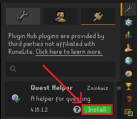

The [Plugin Hub](https://runelite.net/plugin-hub) is a collection of plugins that are provided by third parties not affiliated with RuneLite.

# How to use the Plugin Hub

Using the Plugin Hub is very simple

1. Open the plugin configuration panel.

2. Click the plug icon on the top right of the panel.

3. Find the plugin you want, and click the install button.

# FAQ

### Are the plugins safe?

Plugins are reviewed by RuneLite before they are added to the plugin hub for safety. We don't guarantee that the plugins in the hub will actually work, or that they won't crash your game and kill your HCIM. For more details on the plugin review process, see [Plugin Hub Review](https://github.com/runelite/runelite/wiki/Plugin-Hub-Review).

### A plugin from the Plugin Hub isn't working or is wrong!

All bugs and requests relating to Plugin Hub plugins should be discussed with the plugin's developer. Clicking the 
 button next to the install/remove button in the Hub will take you to the developer's GitHub repository, where you can report an issue just like you would for RuneLite.